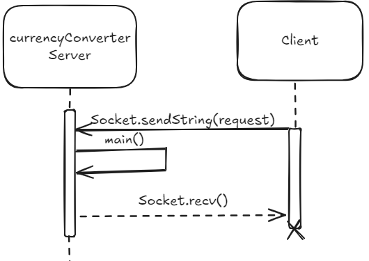

# currency-converter
Microservice for CS 361 by Keegan Forsythe.

## What does this program do?
The currencyConverterServer.py program acts as a server. It listens for requests, processes them, and sends a reply.
The **purpose** of the program is to receive a value amount of a specified currency, convert it to another specified currency,
and return the converted amount as well as the new currency type.

## Using currencyConverterServer.py Program

## Copy the code from Github or clone the repository to your machine.

### Coping
Copying currencyConverterServer.py to a Python file may be the quickest way to begin running the program.

### Cloning
To use currencyConverterServer.py first clone the repository to a directory on your machine.

1. Make sure you have Git installed.
2. Navigate to the directory to which you want to clone the currency-converter repository.
3. On Github on the currency-converter page click the green code button and copy the HTTPS.
4. Run "git clone https://github.com/BadgerMole44/currency-converter.git" from within the desired directory.

## Starting The Program
Ensure you have ZeroMQ installed on your machine. Run python currencyConverterServer.py or python3 currencyConverterServer.py if that does
not work, and the program begins listening.

### For Help with ZeroMQ see the [documentation](https://zeromq.org/get-started/).

## Sending Requests to currencyConverterServer.py and Receiving Replies
To send a request to currencyConverterServer.py follow this example:
1. import zmq    # Ensure ZeroMQ has been installed on your machine
2. context = zmq.Context()
3. socket = context.socket(zmq.REQ) # specifies requests
4. socket.connect("tcp://localhost:5570") # 5570 is the default port number that currencyConverterServer.py uses. if you choose a different port number here you must change it in currencyConverterServer.py.
5. socket.send_string("hello")  # This is the example request
6. message = socket.recv()      # This is the received example reply
7. print(message.decode()) # this will show the message. Because hello is not a valid request the message will show usage text.

## UML Sequence Diagram

